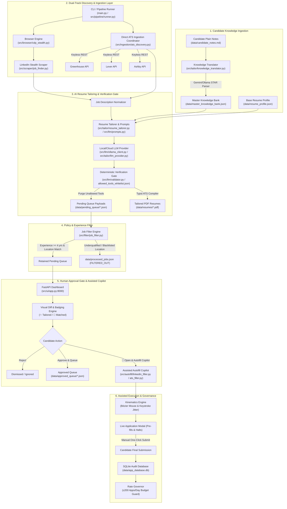

# System Architecture & Technical Specification: LinkedIn Job Search & Application Automator

> **Document Type:** AI-Readable & Human-Reviewable System Architecture Document  
> **Repository:** `manjunathk833/linkedin-automator`  
> **Status:** Production-Ready / Active Development (Branch: `develop`)  
> **Target Audience:** Technical Auditors, Senior SDET Architects, AI Reviewers, Open-Source Contributors  
> 
> 📚 **Complete Documentation Suite in [`docs/`](docs/README.md):**
> * [**01_USER_GUIDE.md**](docs/01_USER_GUIDE.md): Plain-English walkthrough, daily workflows, and customization cheat sheet.
> * [**02_CONCEPTUAL_ARCHITECTURE.md**](docs/02_CONCEPTUAL_ARCHITECTURE.md): Zero-cost economics, dual-track ingestion, and anti-detection threat model.
> * [**03_TECHNICAL_SPECIFICATION.md**](docs/03_TECHNICAL_SPECIFICATION.md): Exhaustive breakdown of Modules 1–10 and data schemas.
> * [**04_USAGE_AND_OPERATIONS.md**](docs/04_USAGE_AND_OPERATIONS.md): CLI subcommands and troubleshooting playbooks.
> * [**05_VERIFICATION_AND_TESTING.md**](docs/05_VERIFICATION_AND_TESTING.md): Catalog of all 32 verification test scripts.

---

## 1. Executive Summary & North Star Vision

The **LinkedIn Job Search & Application Automator** is an autonomous, 100% zero-third-party-cost system designed specifically for **Senior SDET / Lead QA Automation Engineers** (5+ years experience threshold, Bengaluru / India Remote focus).

### Core Pillars
1. **Zero Third-Party Cost Guarantee:** Operates strictly on Google Gemini Free Tier APIs with automatic fallback to local offline LLMs via Ollama (`qwen2.5:7b`). No paid proxies, captcha solvers, or proprietary LLM subscriptions.
2. **Deterministic Anti-Fabrication Grounding:** AI tailoring is strictly constrained to the candidate's authentic profile and master knowledge vault. A deterministic post-generation validation gate filters out hallucinated tech tools before resumes reach employers.
3. **Multi-Channel 10X Discovery:** Scrapes beyond standard keyword searches across 4 distinct discovery vectors: Active Search, Recommended Feed, Recruiter Postings, and Similar Jobs.
4. **Human-in-the-Loop (HITL) Integrity:** Zero autonomous blind applications. Applications must pass through a local FastAPI Web Dashboard (`http://localhost:8000`) for human inspection, resume diff review, and approval.
5. **Headful Visual Automation & Safe Session Persistence:** Employs Chrome DevTools Protocol (CDP) and persistent browser profiles with anti-bot stealth parameters to prevent session invalidation or account suspension.

---

## 2. High-Level System Architecture



---

## 3. Module-by-Module Technical Implementation

### Module 1: CLI Entrypoint & Pipeline Orchestration
* **Files:** [`main.py`](file:///Users/yeshwinmanjunath/development/linkedinjobsearchautomation/main.py), [`src/pipeline/runner.py`](file:///Users/yeshwinmanjunath/development/linkedinjobsearchautomation/src/pipeline/runner.py)
* **Design Pattern:** `argparse.add_subparsers()` decoupled into a `JobSearchPipelineRunner` controller.
* **Capabilities:**
  * `python main.py run` (`pipeline`): One-shot automated workflow (`sync` $\rightarrow$ `search` $\rightarrow$ `filter` $\rightarrow$ `dashboard`).
  * `python main.py search`: Runs multi-channel discovery and resume tailoring.
  * `python main.py sync`: Syncs natural language markdown notes to the master knowledge bank.
  * `python main.py filter`: Evaluates experience threshold on raw scraped jobs.
  * `python main.py dashboard`: Launches FastAPI web dashboard.
  * `python main.py apply [--no-dry-run]`: Executes Easy Apply automation on approved jobs.
  * `python main.py login`: Launches persistent headful Chrome for manual session authentication.
  * `python main.py lint`: Runs Ruff linter and auto-fix formatter.

---

### Module 2: Browser Context, Anti-Detection & Kinematics Engine
* **Files:** [`src/browser/cdp_stealth.py`](file:///Users/yeshwinmanjunath/development/linkedinjobsearchautomation/src/browser/cdp_stealth.py), [`src/browser/kinematics.py`](file:///Users/yeshwinmanjunath/development/linkedinjobsearchautomation/src/browser/kinematics.py), [`src/browser/cdp_connector.py`](file:///Users/yeshwinmanjunath/development/linkedinjobsearchautomation/src/browser/cdp_connector.py)
* **Architecture:** Persistent Chrome profile with runtime CDP isolation, anti-fingerprinting JS evasions, and humanized input kinematics.
* **Stealth & Resilience Parameters:**
  * **CDP Isolation:** Removes `navigator.webdriver` artifact, injects authentic `window.chrome` runtime/loadTimes mocks, and emulates macOS Chrome plugins and English language arrays.
  * **Kinematics Engine:** Formulates non-linear mouse paths using cubic Bézier curves:
    $$B(t) = (1-t)^3 P_0 + 3(1-t)^2 t P_1 + 3(1-t) t^2 P_2 + t^3 P_3, \quad t \in [0, 1]$$
    with smoothstep easing and micro-tremor jitter.
  * **Log-Normal Keystroke Intervals:** Keystroke timings modeled via log-normal distribution ($40–240$ ms per character) with randomized pauses after punctuation.
  * **Dynamic Driver Selection:** Supports drop-in of `rebrowser-playwright` with graceful fallback to persistent system Chrome.

---

### Module 3: Multi-Channel Job Scraper & Description Parser
* **Files:** [`src/scraper/job_finder.py`](file:///Users/yeshwinmanjunath/development/linkedinjobsearchautomation/src/scraper/job_finder.py)
* **Scraping Channels:**
  1. `Search`: Direct keyword search with filters (e.g. `Senior SDET`, `Remote`, `Past 24 Hours`).
  2. `Recommended Feed`: Navigates to `linkedin.com/jobs/` and iterates dynamically loaded recommendation modules.
  3. `Recruiter Posts`: Queries content posts mentioning hiring tags (`#hiring #sdet`).
  4. `Similar Jobs`: Extracts related job cards from the detail view of high-relevance listings.
* **Layout Resilience & Noise Filtering:**
  * Interactive title clicking (`.job-card-list__title`) to trigger detail panel rendering without page reload.
  * Auto-expands "See more" buttons (`button.jobs-description__footer-button`).
  * Regex-based cleaner (`clean_job_description`) strips boilerplate UI noise (e.g., share icons, promo banners, report buttons).
  * Deduplication engine using MD5 composite hashes (`company:title:location`).

---

### Module 4: Grounded AI Resume Tailoring & Anti-Fabrication Gate
* **Files:** [`src/tailor/resume_tailorer.py`](file:///Users/yeshwinmanjunath/development/linkedinjobsearchautomation/src/tailor/resume_tailorer.py), [`src/tailor/llm_provider.py`](file:///Users/yeshwinmanjunath/development/linkedinjobsearchautomation/src/tailor/llm_provider.py), [`src/tailor/fabrication_detector.py`](file:///Users/yeshwinmanjunath/development/linkedinjobsearchautomation/src/tailor/fabrication_detector.py), [`src/tailor/knowledge_translator.py`](file:///Users/yeshwinmanjunath/development/linkedinjobsearchautomation/src/tailor/knowledge_translator.py)
* **LLM Architecture:**
  * `HybridLLMProvider`: Primary provider Google Gemini 3.6 Flash (`temperature=0.0`); automatic fallback to local Ollama (`qwen2.5:7b`).
  * Pydantic schema validation (`TailoredBulletsResponse`, `ParsedKnowledgeResponse`, `ScreeningAnswerResponse`).
* **Anti-Fabrication Defense-in-Depth:**
  * **Level 1 (Prompt Grounding):** Strict prompt instructions and negative few-shot examples forbidding hallucination of tools outside candidate history.
  * **Level 2 (Deterministic Code Gate):** `FabricationDetector` builds an `allowed_tools` set from `resume_profile.json` and `master_knowledge_bank.json`. Any AI bullet containing unallowed tools (e.g., Playwright, Cypress, Golang) is **stripped and discarded** prior to queueing.
* **Knowledge Bank Translation Layer:**
  * Candidates write plain text notes in `data/candidate_notes.md`.
  * `KnowledgeBankTranslator` parses bullet points, chunks them into batches of 5, translates them to STAR format, deduplicates via MD5 hashing, and atomically writes to `data/master_knowledge_bank.json` via `os.replace()`.

---

### Module 5: Experience & Policy Filter Engine
* **Files:** [`src/filter/job_filter.py`](file:///Users/yeshwinmanjunath/development/linkedinjobsearchautomation/src/filter/job_filter.py)
* **Heuristics:**
  * Regex pattern matching for experience thresholds (e.g., `(\d+)\+?\s*years?`).
  * Filters out underqualified jobs (<4 years required) or overqualified executive roles (>12 years).
  * Strict location rules: Retains Bengaluru (Onsite/Hybrid/Remote) or India (Remote). Discards non-Bengaluru onsite roles (e.g., Pune, Hyderabad onsite).
  * Atomic synchronization with `data/processed_jobs.json`.

---

### Module 6: Human-in-the-Loop Approval Gate Dashboard
* **Files:** [`src/ui/app.py`](file:///Users/yeshwinmanjunath/development/linkedinjobsearchautomation/src/ui/app.py), [`src/ui/static/app.js`](file:///Users/yeshwinmanjunath/development/linkedinjobsearchautomation/src/ui/static/app.js), [`src/ui/static/index.html`](file:///Users/yeshwinmanjunath/development/linkedinjobsearchautomation/src/ui/static/index.html)
* **Features:**
  * FastAPI server serving a dark-mode, glassmorphism interface at `http://localhost:8000`.
  * **Resume Diff Engine:** `compute_resume_diff` compares tailored bullets against base resume achievements, highlighting differences with glowing `✨ Tailored` and `🎯 Matched: <skills>` tags.
  * Interactive Actions: Approve (moves to `data/approved_queue/`), Reject, and Edit Resume.
  * Analytics panel tracking discovery counts, filter rates, and application status.

---

### Module 7: Easy Apply Automation Engine
* **Files:** [`src/automation/easy_apply.py`](file:///Users/yeshwinmanjunath/development/linkedinjobsearchautomation/src/automation/easy_apply.py)
* **Automation Workflow:**
  1. Opens job listing in persistent browser context.
  2. Detects and clicks Easy Apply triggers (`.jobs-apply-button`, `button[data-job-id]`).
  3. Iterates modal form steps: contact info, phone, resume upload, screening questions.
  4. Resolves screening questions using `HybridLLMProvider.answer_screening_question()` grounded in candidate profile.
  5. **Safety Gate:** Default `dry_run=True` fills forms, captures step screenshots, and closes the modal without submitting. Real submission requires explicit `--no-dry-run`.
  6. Logs outcome to `data/application_history.json`.

---

### Module 7: Multi-Source Keyless ATS Ingestion Engine
* **Files:** [`src/ingestion/greenhouse.py`](file:///Users/yeshwinmanjunath/development/linkedinjobsearchautomation/src/ingestion/greenhouse.py), [`src/ingestion/lever.py`](file:///Users/yeshwinmanjunath/development/linkedinjobsearchautomation/src/ingestion/lever.py), [`src/ingestion/ashby.py`](file:///Users/yeshwinmanjunath/development/linkedinjobsearchautomation/src/ingestion/ashby.py), [`src/ingestion/ats_discovery.py`](file:///Users/yeshwinmanjunath/development/linkedinjobsearchautomation/src/ingestion/ats_discovery.py), [`scripts/seed_companies.py`](file:///Users/yeshwinmanjunath/development/linkedinjobsearchautomation/scripts/seed_companies.py), [`scripts/run_ingestion.py`](file:///Users/yeshwinmanjunath/development/linkedinjobsearchautomation/scripts/run_ingestion.py)
* **Architecture:** Zero-cost, unauthenticated REST ingestion directly querying public ATS endpoints:
  * Greenhouse: `https://boards-api.greenhouse.io/v1/boards/{slug}/jobs?content=true`
  * Lever: `https://api.lever.co/v0/postings/{slug}?mode=json`
  * Ashby: `https://api.ashbyhq.com/posting-api/job-board/{slug}?includeCompensation=true`
* **Features:**
  * **Enterprise Registry:** 37+ target tech companies in India / Remote maintained in `data/config/target_companies.json`.
  * **Async Concurrency:** Dispatches parallel non-blocking HTTP requests with semaphore rate-limiting (`asyncio.Semaphore(10)`).
  * **Unified Normalization:** Ingests raw job payloads into structured Pydantic `JobListing` models and formats them for queue inspection.

---

### Module 8: Deterministic Verification Gate & Typst Resume Compiler
* **Files:** [`src/llm/validator.py`](file:///Users/yeshwinmanjunath/development/linkedinjobsearchautomation/src/llm/validator.py), [`data/profile/allowed_tools_whitelist.json`](file:///Users/yeshwinmanjunath/development/linkedinjobsearchautomation/data/profile/allowed_tools_whitelist.json), [`src/compiler/typst_generator.py`](file:///Users/yeshwinmanjunath/development/linkedinjobsearchautomation/src/compiler/typst_generator.py), [`src/compiler/templates/resume_template.typ`](file:///Users/yeshwinmanjunath/development/linkedinjobsearchautomation/src/compiler/templates/resume_template.typ)
* **Architecture:** Code-level deterministic integrity gate and single-column ATS PDF compiler:
  * **Whitelist Enforcement:** Validates every tailored bullet against `allowed_tools_whitelist.json`. 100% purges unauthorized tools (e.g. Cypress, Kubernetes, Golang, Playwright) or substitutes them with authentic equivalents (Selenium, Docker, Python).
  * **Single-Column ATS PDFs:** Compiles clean, ATS-compliant PDFs into `data/resumes/{company}_{job_id}_{role_slug}.pdf` using Typst with resilient HTML/Playwright fallback.

---

### Module 9: Dashboard-Triggered Assisted Autofill Copilot
* **Files:** [`src/autofill/vendor_schemas.py`](file:///Users/yeshwinmanjunath/development/linkedinjobsearchautomation/src/autofill/vendor_schemas.py), [`src/autofill/form_mapper.py`](file:///Users/yeshwinmanjunath/development/linkedinjobsearchautomation/src/autofill/form_mapper.py), [`src/autofill/ats_filler.py`](file:///Users/yeshwinmanjunath/development/linkedinjobsearchautomation/src/autofill/ats_filler.py), [`src/autofill/linkedin_filler.py`](file:///Users/yeshwinmanjunath/development/linkedinjobsearchautomation/src/autofill/linkedin_filler.py), [`src/ui/app.py`](file:///Users/yeshwinmanjunath/development/linkedinjobsearchautomation/src/ui/app.py)
* **Architecture:** Human-in-the-Loop copilot triggered directly from the FastAPI approval dashboard (`🚀 Launch Copilot`):
  * **Standardized Vendor Schemas & Master Profile:** Binds to canonical candidate ground truth in `data/profile/candidate_master_data.json`.
  * **Modular Vendor Autofill Handlers:** Custom verified handlers for Greenhouse, Lever, Ashby, Workday, and LinkedIn Easy Apply.
  * **Multi-Tab & Popup Switching:** Intercepts `<a target="_blank">` and `window.open()` popups, focuses the active tab on macOS, and pierces nested iframes.
  * **Modal Traversal:** Enters form details using humanized Bézier movements and keystroke jitter, attaches the tailored PDF resume, and navigates multi-step forms.
  * **Pause-Before-Submit Hook:** Automatically halts at the final "Review your application" step, sounding an alert and leaving the browser open for manual human verification and 1-click submission.

---

### Module 10: Governance, SQLite Audit Trails & Rate Governor
* **Files:** [`src/storage/database.py`](file:///Users/yeshwinmanjunath/development/linkedinjobsearchautomation/src/storage/database.py), [`src/autofill/governor.py`](file:///Users/yeshwinmanjunath/development/linkedinjobsearchautomation/src/autofill/governor.py)
* **Architecture:** Relational persistence and safety policy governor:
  * **SQLite Audit Trail:** `data/app_database.db` persists `job_applications` (source, URL, resume path, tailored JSON, timestamps) and `daily_submission_limits`.
  * **Rolling Daily Budget Governor:** Enforces a configurable daily quota (default $\le 200$ applications per 24 hours, customized via `config.yaml`) to guard against runaway loops while supporting high-volume job applications.

---

## 4. Data Architecture & Storage Schema

```
data/
├── config/
│   └── target_companies.json    # Target enterprise registry (37+ Greenhouse, Lever, Ashby boards)
├── profile/
│   ├── candidate_master_data.json   # Canonical candidate master profile (contact, edu, exp, URLs, EEOC)
│   └── allowed_tools_whitelist.json # Authenticated tools whitelist (48 allowed, 10 disallowed)
├── candidate_notes.md           # User-facing plain text notes for new accomplishments
├── resume_profile.json          # Authentic base profile (skills matrix, experience, education)
├── master_knowledge_bank.json   # Domain-categorized STAR achievement vault (deduplicated)
├── processed_jobs.json          # Master ledger of all discovered jobs & composite hashes
├── application_history.json     # Audit trail of Easy Apply submissions
├── app_database.db              # Relational SQLite audit log and daily rate limits
├── resumes/                     # (Git-ignored) Compiled single-column ATS PDFs
├── pending_queue/               # (Git-ignored) Scraped & tailored job payloads awaiting review
└── approved_queue/              # (Git-ignored) Candidate-approved payloads ready for apply
```

### Job State Machine Lifecycle
```
[Direct ATS APIs / LinkedIn Scraper]
               │
               ▼
           [PENDING] ──(Experience Filter)──> [FILTERED_OUT] (Archived in processed_jobs.json)
               │
           (Passed Filter)
               ▼
        [PENDING QUEUE] ──(Dashboard Review)──> [DISMISSED]
               │
        (User Triggered)
        ┌──────┴──────────────────────────┐
        ▼                                 ▼
 [APPROVED QUEUE]              [🚀 OPEN & AUTOFILL COPILOT]
        │                                 │
 (Batch Apply Run)             (Headful Stealth Session Pre-fills & Halts)
        │                                 │
        ▼                                 ▼
   [APPLIED] <─────────────────── [Candidate Manual 1-Click Submit]
        │
        ▼
[SQLite Audit Log + Budget Counter (data/app_database.db)]
```

---

## 5. Verification Suite & Quality Assurance

All features are covered by dedicated, standalone verification scripts in `verify/`:

| Verification Script | Component Tested | Validation Criteria |
| :--- | :--- | :--- |
| `verify/14_test_multi_channel_discovery.py` | 4-Channel Scraper | Validates pagination, title extraction, and deduplication across all 4 channels |
| `verify/21_test_description_and_diff.py` | Description Cleaner & Diff | Verifies layout noise removal and accurate `is_tailored` badging |
| `verify/24_test_knowledge_translation.py` | Knowledge Translator | Verifies markdown bullet extraction, chunking, MD5 dedup, and atomic writing |
| `verify/25_test_fabrication_detector.py` | Fabrication Detector | Proves hallucinated tools (Playwright/Cypress) are detected and stripped |
| `verify/26_test_pipeline_runner.py` | Pipeline Runner & CLI | Tests end-to-end stage execution, subparser commands, and error handling |
| `verify/27_test_kinematics_and_stealth.py` | Kinematics & CDP Stealth | Validates cubic Bézier curves, log-normal typing jitter, and CDP evasion |
| `verify/28_test_ollama_local.py` | Local Ollama Client | Tests async connection, token benchmarks, and graceful offline fallback |
| `verify/29_test_ats_ingestion.py` | Multi-Source ATS Collectors | Tests unauthenticated Greenhouse, Lever, and Ashby ingestion in <3s |
| `verify/30_test_tailoring_and_compilation.py` | Whitelist Gate & PDF Compiler | Tests 100% false-skill purging and single-column ATS PDF compilation |
| `verify/31_test_assisted_autofill.py` | Assisted Autofill Copilot | Verifies form field heuristics, candidate contact resolver, and 404 guards |
| `verify/32_test_governance_and_sqlite.py` | SQLite DB & Rate Governor | Verifies audit logging transactions and 15/day quota safety cutoff |
| `verify/33_test_resume_and_knowledge_regeneration.py` | Resume & Knowledge Vault | Verifies 100% Pydantic compliance and 11 authentic STAR achievements |
| `verify/34_test_dashboard_data_flow.py` | Dashboard Flow | Verifies API responses, job card schema, and payload sanitization |
| `verify/35_test_approval_gate_coercion.py` | Approval Gate Coercion | Tests string notice periods and type coercion during job approval |
| `verify/36_test_queue_status_flow.py` | Real-Time Queue Status | Tests `/api/queue-status` counts and state transitions between queues |
| `verify/37_test_approved_queue_ui_flow.py` | Approved Queue & PDF Preview | Verifies `/api/approved-jobs`, inline `/api/pdf/{job_id}`, and PDF rendering |
| `verify/38_test_static_cache_headers.py` | Cache-Busting & Headers | Tests no-cache headers and static asset version query parameters |
| `verify/39_test_ats_filler_resilience.py` | ATS URL & Trigger Resilience | Tests canonical ATS URL resolution and 'Apply' button trigger detection |
| `verify/40_test_new_tab_ats_handling.py` | Multi-Tab & Popup Autofill | Tests target="_blank" and window.open() new-tab switching, focus, and form filling |
| `verify/41_test_standardized_vendor_autofill.py` | Vendor Schemas & Filler Engine | Verifies standardized candidate profile mapping across Greenhouse, Lever, Ashby, Workday, LinkedIn |
| `verify/42_test_safety_governor_cap_200.py` | Safety Governor Cap Scaled to 200 | Verifies dynamic config loading, default 200/day quota, and boundary cutoff behavior |
| `verify/43_test_coinbase_greenhouse_live_fill.py` | Live Coinbase Greenhouse Fill | Verifies React-Select combobox handling, custom disclosures, AI usage mapping, and resume attachment |
| `verify/44_test_resume_professional_naming.py` | Professional Candidate Resume Naming | Verifies candidate-centric resume filenames (`Manjunath_HK_<Company>_<Token>_Resume.pdf`), backward compatibility, and clean download headers |
| `verify/45_test_staging_job_metadata_enrichment.py` | Staging Job Intelligence Enrichment | Verifies location classification (US-only warnings vs India eligibility), experience extraction, direct job links, and salary disclosures |

* **Linter Standard:** 100% compliant with Ruff (`python main.py lint` passes with 0 errors across 107 project files).

---

## 6. External Reviewer Threat Model & Security Audit

### Threat 1: LinkedIn Anti-Scraping & Account Safety
* **Risk:** Automated scraping or high-frequency requests can trigger CAPTCHA or temporary session checkpoints.
* **Current Mitigation:**
  * Persistent user browser context (preserves authentic login cookies and TLS fingerprints).
  * Humanized delays (2–5 seconds), random mouse movements, and natural scrolling.
  * Headful execution for real-time visual inspection by candidate.
* **Recommended Next Step:** Add request budgeting (e.g., maximum 25 job discoveries per session).

### Threat 2: LLM Hallucinations in Candidate Qualifications
* **Risk:** LLM embellishing candidate capabilities or claiming unverified skills to match job descriptions.
* **Current Mitigation:**
  * Deterministic `FabricationDetector` runs post-generation to enforce a strict whitelist of candidate tools.
  * Prompt instructions with negative few-shot examples and `temperature=0.0`.
  * Human Approval Gate on Dashboard prior to submission.
* **Recommended Next Step:** Add unit test assertion checks during automated pipeline runs to raise alarms if unverified tools slip through.

### Threat 3: API Quota Exhaustion (Gemini Free Tier)
* **Risk:** Hitting 20 RPM / daily limits on Gemini Free Tier during large batch tailoring.
* **Current Mitigation:**
  * Multi-layer fallback to local offline Ollama (`qwen2.5:7b`).
  * Heuristic fallback for non-AI operation if all LLMs are unreachable.
  * Batch chunking of 5 items per request.
* **Recommended Next Step:** Implement exponential backoff with jitter on HTTP 429 responses.

---

## 7. Project Progress & Milestones

- [x] **Milestone 1:** Headful persistent CDP browser session and manual login flow.
- [x] **Milestone 2:** 4-Channel Discovery Scraper (Search, Recommended, Posts, Similar).
- [x] **Milestone 3:** Job description cleaner and noise filter.
- [x] **Milestone 4:** Hybrid LLM Provider (Gemini Free Tier + Ollama fallback).
- [x] **Milestone 5:** Master Knowledge Bank & Natural Language Translation Layer (`data/candidate_notes.md` $\rightarrow$ `master_knowledge_bank.json`).
- [x] **Milestone 6:** Anti-Fabrication Grounding & Deterministic Tool Verification Gate.
- [x] **Milestone 7:** FastAPI Approval Gate Dashboard with visual resume diff engine.
- [x] **Milestone 8:** Easy Apply Automation with Screening QA Solver and Dry-Run safety.
- [x] **Milestone 9:** Unified Subcommand CLI (`argparse.add_subparsers`) & One-Shot Pipeline Runner (`python main.py run`).
- [x] **Milestone 10:** Git branching strategy (`develop` $\rightarrow$ `main` PR workflow) and clean `.gitignore` queue management.
- [x] **Milestone 11 (Sprint 1):** Local Runtime & Anti-Detection Kinematics (Cubic Bézier mouse paths, log-normal keystroke jitter, and CDP isolation).
- [x] **Milestone 12 (Sprint 2):** Multi-Source Keyless ATS Ingestion Engine (Greenhouse, Lever, and Ashby unauthenticated JSON collectors across 37+ target enterprises).
- [x] **Milestone 13 (Sprint 3):** Grounded Tailoring, Whitelist Verification Gate & Typst Single-Column ATS PDF Compiler.
- [x] **Milestone 14 (Sprint 4):** Dashboard-Triggered Assisted Autofill Copilot (`🚀 Open & Autofill Copilot` with pause-before-submit modal hook).
- [x] **Milestone 15 (Sprint 5):** Relational SQLite Audit Trail (`data/app_database.db`) & Rolling 24-Hour Safety Rate Governor ($\le 15$ apps/day).
- [x] **Milestone 16:** Dual-Mode Application Command Center with Approved Queue, live search bar, and inline PDF preview (`/api/pdf/{job_id}`).
- [x] **Milestone 17:** Canonical ATS URL resolution and resilient form trigger detection (`resolve_canonical_ats_url`).
- [x] **Milestone 18:** Multi-tab & popup window auto-switching for ATS application links (`<a target="_blank">` and `window.open()`).
- [x] **Milestone 19:** Standardized Vendor Autofill Schemas & Centralized Candidate Master Profile across Greenhouse, Lever, Ashby, Workday, and LinkedIn Easy Apply.
- [x] **Milestone 20:** Dynamic Safety Governor scaling to 200/day configurable via `config.yaml`.
- [x] **Milestone 21:** Modern React-Select Combobox Autofill and Multi-Job Experience Loop ("Add another" for multiple positions).
- [x] **Milestone 22:** Professional Candidate-Centric Resume PDF Naming (`Manjunath_HK_<Company>_<Token>_Resume.pdf`) and clean browser download headers.
- [x] **Milestone 23:** Upfront Staging Job Intelligence & Location Warnings (US-only alert badges, required experience extractor, direct posting link, and compensation view).

---

## 8. Quick Start Guide

### Prerequisites
* macOS / Linux
* Python 3.9+
* Google Chrome installed
* Optional: Local Ollama with `qwen2.5:7b` (for offline execution)

### Installation
```bash
# 1. Clone repository
git clone https://github.com/manjunathk833/linkedin-automator.git
cd linkedin-automator

# 2. Set up virtual environment
python3 -m venv venv
source venv/bin/activate
pip install -r requirements.txt  # or run verify scripts to install dependencies

# 3. Configure environment
cp .env.example .env
# Add GEMINI_API_KEY to .env (Free tier from https://aistudio.google.com/)

# 4. One-Time LinkedIn Login
python main.py login
```

### Execution Commands
```bash
# Run full one-shot pipeline (Sync Notes -> Discover Jobs -> Filter -> Launch Dashboard)
python main.py run

# Or run individual subcommands:
python main.py sync        # Ingest candidate_notes.md
python main.py search      # Scrape & tailor jobs
python main.py filter      # Experience filter
python main.py dashboard   # Open approval gate at http://127.0.0.1:8000
python main.py apply       # Execute Easy Apply (Dry run default)
python main.py lint        # Code formatting and linter check
```
