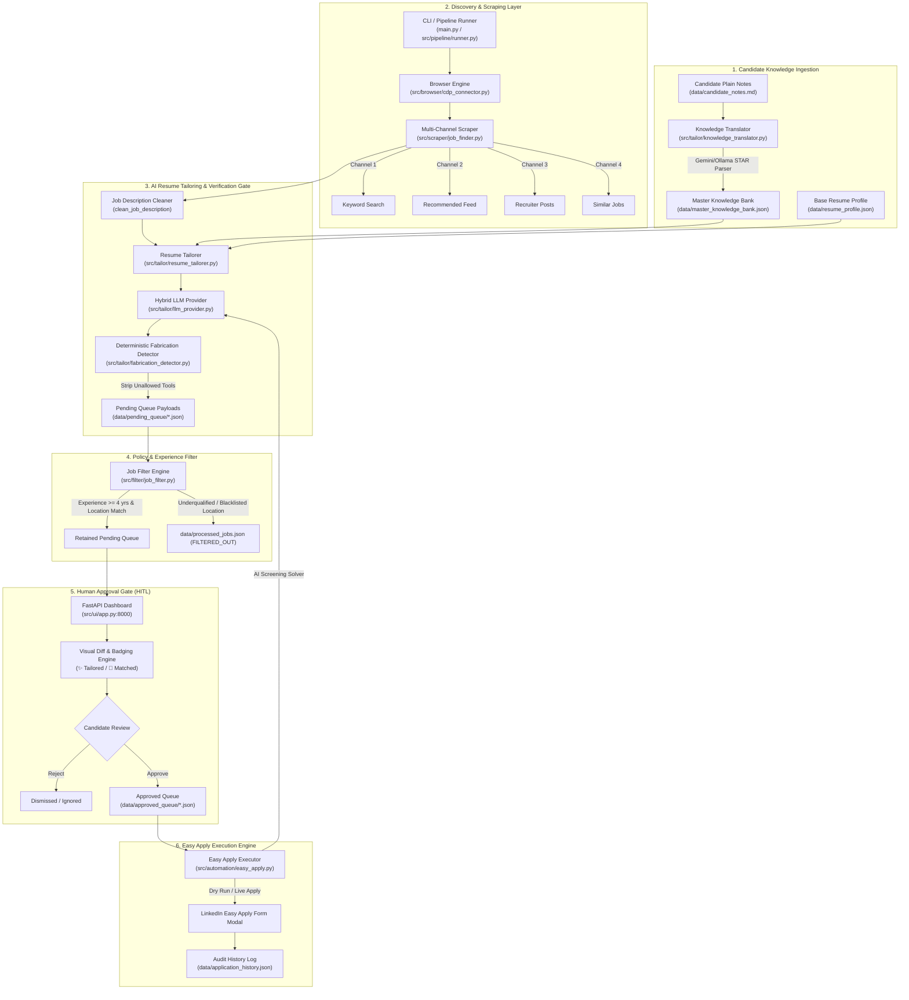

# System Architecture & Technical Specification: LinkedIn Job Search & Application Automator

> **Document Type:** AI-Readable & Human-Reviewable System Architecture Document  
> **Repository:** `manjunathk833/linkedin-automator`  
> **Status:** Production-Ready / Active Development (Branch: `develop`)  
> **Target Audience:** Technical Auditors, Senior SDET Architects, AI Reviewers, Open-Source Contributors

---

## 1. Executive Summary & North Star Vision

The **LinkedIn Job Search & Application Automator** is an autonomous, 100% zero-third-party-cost system designed specifically for **Senior SDET / Lead QA Automation Engineers** (5+ years experience threshold, Bengaluru / India Remote focus).

### Core Pillars
1. **Zero Third-Party Cost Guarantee:** Operates strictly on Google Gemini Free Tier APIs with automatic fallback to local offline LLMs via Ollama (`qwen2.5:7b`). No paid proxies, captcha solvers, or proprietary LLM subscriptions.
2. **Deterministic Anti-Fabrication Grounding:** AI tailoring is strictly constrained to the candidate's authentic profile and master knowledge vault. A deterministic post-generation validation gate filters out hallucinated tech tools before resumes reach employers.
3. **Multi-Channel 10X Discovery:** Scrapes beyond standard keyword searches across 4 distinct discovery vectors: Active Search, Recommended Feed, Recruiter Postings, and Similar Jobs.
4. **Human-in-the-Loop (HITL) Integrity:** Zero autonomous blind applications. Applications must pass through a local FastAPI Web Dashboard (`http://localhost:8000`) for human inspection, resume diff review, and approval.
5. **Headful Visual Automation & Safe Session Persistence:** Employs Chrome DevTools Protocol (CDP) and persistent browser profiles with anti-bot stealth parameters to prevent session invalidation or account suspension.

---

## 2. High-Level System Architecture



---

## 3. Module-by-Module Technical Implementation

### Module 1: CLI Entrypoint & Pipeline Orchestration
* **Files:** [`main.py`](file:///Users/yeshwinmanjunath/development/linkedinjobsearchautomation/main.py), [`src/pipeline/runner.py`](file:///Users/yeshwinmanjunath/development/linkedinjobsearchautomation/src/pipeline/runner.py)
* **Design Pattern:** `argparse.add_subparsers()` decoupled into a `JobSearchPipelineRunner` controller.
* **Capabilities:**
  * `python main.py run` (`pipeline`): One-shot automated workflow (`sync` $\rightarrow$ `search` $\rightarrow$ `filter` $\rightarrow$ `dashboard`).
  * `python main.py search`: Runs multi-channel discovery and resume tailoring.
  * `python main.py sync`: Syncs natural language markdown notes to the master knowledge bank.
  * `python main.py filter`: Evaluates experience threshold on raw scraped jobs.
  * `python main.py dashboard`: Launches FastAPI web dashboard.
  * `python main.py apply [--no-dry-run]`: Executes Easy Apply automation on approved jobs.
  * `python main.py login`: Launches persistent headful Chrome for manual session authentication.
  * `python main.py lint`: Runs Ruff linter and auto-fix formatter.

---

### Module 2: Browser Context & Anti-Detection Layer
* **Files:** [`src/browser/cdp_connector.py`](file:///Users/yeshwinmanjunath/development/linkedinjobsearchautomation/src/browser/cdp_connector.py)
* **Architecture:** Playwright persistent browser context using real user Chrome profile (`.browser_data/`).
* **Stealth & Resilience Parameters:**
  * Disables Automation flags (`--disable-blink-features=AutomationControlled`).
  * Injects humanized viewport dimensions (`1366x768`), randomized delays (2000–5000ms), and natural scrolling.
  * Safe CDP connection handling with graceful fallback to standard `launch_persistent_context`.

---

### Module 3: Multi-Channel Job Scraper & Description Parser
* **Files:** [`src/scraper/job_finder.py`](file:///Users/yeshwinmanjunath/development/linkedinjobsearchautomation/src/scraper/job_finder.py)
* **Scraping Channels:**
  1. `Search`: Direct keyword search with filters (e.g. `Senior SDET`, `Remote`, `Past 24 Hours`).
  2. `Recommended Feed`: Navigates to `linkedin.com/jobs/` and iterates dynamically loaded recommendation modules.
  3. `Recruiter Posts`: Queries content posts mentioning hiring tags (`#hiring #sdet`).
  4. `Similar Jobs`: Extracts related job cards from the detail view of high-relevance listings.
* **Layout Resilience & Noise Filtering:**
  * Interactive title clicking (`.job-card-list__title`) to trigger detail panel rendering without page reload.
  * Auto-expands "See more" buttons (`button.jobs-description__footer-button`).
  * Regex-based cleaner (`clean_job_description`) strips boilerplate UI noise (e.g., share icons, promo banners, report buttons).
  * Deduplication engine using MD5 composite hashes (`company:title:location`).

---

### Module 4: Grounded AI Resume Tailoring & Anti-Fabrication Gate
* **Files:** [`src/tailor/resume_tailorer.py`](file:///Users/yeshwinmanjunath/development/linkedinjobsearchautomation/src/tailor/resume_tailorer.py), [`src/tailor/llm_provider.py`](file:///Users/yeshwinmanjunath/development/linkedinjobsearchautomation/src/tailor/llm_provider.py), [`src/tailor/fabrication_detector.py`](file:///Users/yeshwinmanjunath/development/linkedinjobsearchautomation/src/tailor/fabrication_detector.py), [`src/tailor/knowledge_translator.py`](file:///Users/yeshwinmanjunath/development/linkedinjobsearchautomation/src/tailor/knowledge_translator.py)
* **LLM Architecture:**
  * `HybridLLMProvider`: Primary provider Google Gemini 3.6 Flash (`temperature=0.0`); automatic fallback to local Ollama (`qwen2.5:7b`).
  * Pydantic schema validation (`TailoredBulletsResponse`, `ParsedKnowledgeResponse`, `ScreeningAnswerResponse`).
* **Anti-Fabrication Defense-in-Depth:**
  * **Level 1 (Prompt Grounding):** Strict prompt instructions and negative few-shot examples forbidding hallucination of tools outside candidate history.
  * **Level 2 (Deterministic Code Gate):** `FabricationDetector` builds an `allowed_tools` set from `resume_profile.json` and `master_knowledge_bank.json`. Any AI bullet containing unallowed tools (e.g., Playwright, Cypress, Golang) is **stripped and discarded** prior to queueing.
* **Knowledge Bank Translation Layer:**
  * Candidates write plain text notes in `data/candidate_notes.md`.
  * `KnowledgeBankTranslator` parses bullet points, chunks them into batches of 5, translates them to STAR format, deduplicates via MD5 hashing, and atomically writes to `data/master_knowledge_bank.json` via `os.replace()`.

---

### Module 5: Experience & Policy Filter Engine
* **Files:** [`src/filter/job_filter.py`](file:///Users/yeshwinmanjunath/development/linkedinjobsearchautomation/src/filter/job_filter.py)
* **Heuristics:**
  * Regex pattern matching for experience thresholds (e.g., `(\d+)\+?\s*years?`).
  * Filters out underqualified jobs (<4 years required) or overqualified executive roles (>12 years).
  * Strict location rules: Retains Bengaluru (Onsite/Hybrid/Remote) or India (Remote). Discards non-Bengaluru onsite roles (e.g., Pune, Hyderabad onsite).
  * Atomic synchronization with `data/processed_jobs.json`.

---

### Module 6: Human-in-the-Loop Approval Gate Dashboard
* **Files:** [`src/ui/app.py`](file:///Users/yeshwinmanjunath/development/linkedinjobsearchautomation/src/ui/app.py), [`src/ui/static/app.js`](file:///Users/yeshwinmanjunath/development/linkedinjobsearchautomation/src/ui/static/app.js), [`src/ui/static/index.html`](file:///Users/yeshwinmanjunath/development/linkedinjobsearchautomation/src/ui/static/index.html)
* **Features:**
  * FastAPI server serving a dark-mode, glassmorphism interface at `http://localhost:8000`.
  * **Resume Diff Engine:** `compute_resume_diff` compares tailored bullets against base resume achievements, highlighting differences with glowing `✨ Tailored` and `🎯 Matched: <skills>` tags.
  * Interactive Actions: Approve (moves to `data/approved_queue/`), Reject, and Edit Resume.
  * Analytics panel tracking discovery counts, filter rates, and application status.

---

### Module 7: Easy Apply Automation Engine
* **Files:** [`src/automation/easy_apply.py`](file:///Users/yeshwinmanjunath/development/linkedinjobsearchautomation/src/automation/easy_apply.py)
* **Automation Workflow:**
  1. Opens job listing in persistent browser context.
  2. Detects and clicks Easy Apply triggers (`.jobs-apply-button`, `button[data-job-id]`).
  3. Iterates modal form steps: contact info, phone, resume upload, screening questions.
  4. Resolves screening questions using `HybridLLMProvider.answer_screening_question()` grounded in candidate profile.
  5. **Safety Gate:** Default `dry_run=True` fills forms, captures step screenshots, and closes the modal without submitting. Real submission requires explicit `--no-dry-run`.
  6. Logs outcome to `data/application_history.json`.

---

## 4. Data Architecture & Storage Schema

```
data/
├── candidate_notes.md           # User-facing plain text notes for new accomplishments
├── resume_profile.json          # Authentic base profile (skills matrix, experience, education)
├── master_knowledge_bank.json   # Domain-categorized STAR achievement vault (deduplicated)
├── processed_jobs.json          # Master ledger of all discovered jobs & composite hashes
├── application_history.json     # Audit trail of Easy Apply submissions
├── pending_queue/               # (Git-ignored) Scraped & tailored job payloads awaiting review
└── approved_queue/              # (Git-ignored) Candidate-approved payloads ready for apply
```

### Job State Machine Lifecycle
```
[Scraped Listing]
       │
       ▼
   [PENDING] ──(Experience Filter)──> [FILTERED_OUT] (Archived in processed_jobs.json)
       │
   (Passed Filter)
       ▼
 [PENDING QUEUE] ──(Dashboard Review)──> [DISMISSED]
       │
  (User Approved)
       ▼
[APPROVED QUEUE] ──(Easy Apply Run)──> [APPLIED] (Logged in application_history.json)
```

---

## 5. Verification Suite & Quality Assurance

All features are covered by dedicated, standalone verification scripts in `verify/`:

| Verification Script | Component Tested | Validation Criteria |
| :--- | :--- | :--- |
| `verify/14_test_multi_channel_discovery.py` | 4-Channel Scraper | Validates pagination, title extraction, and deduplication across all 4 channels |
| `verify/21_test_description_and_diff.py` | Description Cleaner & Diff | Verifies layout noise removal and accurate `is_tailored` badging |
| `verify/24_test_knowledge_translation.py` | Knowledge Translator | Verifies markdown bullet extraction, chunking, MD5 dedup, and atomic writing |
| `verify/25_test_fabrication_detector.py` | Fabrication Detector | Proves hallucinated tools (Playwright/Cypress) are detected and stripped |
| `verify/26_test_pipeline_runner.py` | Pipeline Runner & CLI | Tests end-to-end stage execution, subparser commands, and error handling |

* **Linter Standard:** 100% compliant with Ruff (`python main.py lint` passes with 0 errors across 58 project files).

---

## 6. External Reviewer Threat Model & Security Audit

### Threat 1: LinkedIn Anti-Scraping & Account Safety
* **Risk:** Automated scraping or high-frequency requests can trigger CAPTCHA or temporary session checkpoints.
* **Current Mitigation:**
  * Persistent user browser context (preserves authentic login cookies and TLS fingerprints).
  * Humanized delays (2–5 seconds), random mouse movements, and natural scrolling.
  * Headful execution for real-time visual inspection by candidate.
* **Recommended Next Step:** Add request budgeting (e.g., maximum 25 job discoveries per session).

### Threat 2: LLM Hallucinations in Candidate Qualifications
* **Risk:** LLM embellishing candidate capabilities or claiming unverified skills to match job descriptions.
* **Current Mitigation:**
  * Deterministic `FabricationDetector` runs post-generation to enforce a strict whitelist of candidate tools.
  * Prompt instructions with negative few-shot examples and `temperature=0.0`.
  * Human Approval Gate on Dashboard prior to submission.
* **Recommended Next Step:** Add unit test assertion checks during automated pipeline runs to raise alarms if unverified tools slip through.

### Threat 3: API Quota Exhaustion (Gemini Free Tier)
* **Risk:** Hitting 20 RPM / daily limits on Gemini Free Tier during large batch tailoring.
* **Current Mitigation:**
  * Multi-layer fallback to local offline Ollama (`qwen2.5:7b`).
  * Heuristic fallback for non-AI operation if all LLMs are unreachable.
  * Batch chunking of 5 items per request.
* **Recommended Next Step:** Implement exponential backoff with jitter on HTTP 429 responses.

---

## 7. Project Progress & Milestones

- [x] **Milestone 1:** Headful persistent CDP browser session and manual login flow.
- [x] **Milestone 2:** 4-Channel Discovery Scraper (Search, Recommended, Posts, Similar).
- [x] **Milestone 3:** Job description cleaner and noise filter.
- [x] **Milestone 4:** Hybrid LLM Provider (Gemini Free Tier + Ollama fallback).
- [x] **Milestone 5:** Master Knowledge Bank & Natural Language Translation Layer (`data/candidate_notes.md` $\rightarrow$ `master_knowledge_bank.json`).
- [x] **Milestone 6:** Anti-Fabrication Grounding & Deterministic Tool Verification Gate.
- [x] **Milestone 7:** FastAPI Approval Gate Dashboard with visual resume diff engine.
- [x] **Milestone 8:** Easy Apply Automation with Screening QA Solver and Dry-Run safety.
- [x] **Milestone 9:** Unified Subcommand CLI (`argparse.add_subparsers`) & One-Shot Pipeline Runner (`python main.py run`).
- [x] **Milestone 10:** Git branching strategy (`develop` $\rightarrow$ `main` PR workflow) and clean `.gitignore` queue management.

---

## 8. Quick Start Guide

### Prerequisites
* macOS / Linux
* Python 3.9+
* Google Chrome installed
* Optional: Local Ollama with `qwen2.5:7b` (for offline execution)

### Installation
```bash
# 1. Clone repository
git clone https://github.com/manjunathk833/linkedin-automator.git
cd linkedin-automator

# 2. Set up virtual environment
python3 -m venv venv
source venv/bin/activate
pip install -r requirements.txt  # or run verify scripts to install dependencies

# 3. Configure environment
cp .env.example .env
# Add GEMINI_API_KEY to .env (Free tier from https://aistudio.google.com/)

# 4. One-Time LinkedIn Login
python main.py login
```

### Execution Commands
```bash
# Run full one-shot pipeline (Sync Notes -> Discover Jobs -> Filter -> Launch Dashboard)
python main.py run

# Or run individual subcommands:
python main.py sync        # Ingest candidate_notes.md
python main.py search      # Scrape & tailor jobs
python main.py filter      # Experience filter
python main.py dashboard   # Open approval gate at http://127.0.0.1:8000
python main.py apply       # Execute Easy Apply (Dry run default)
python main.py lint        # Code formatting and linter check
```
